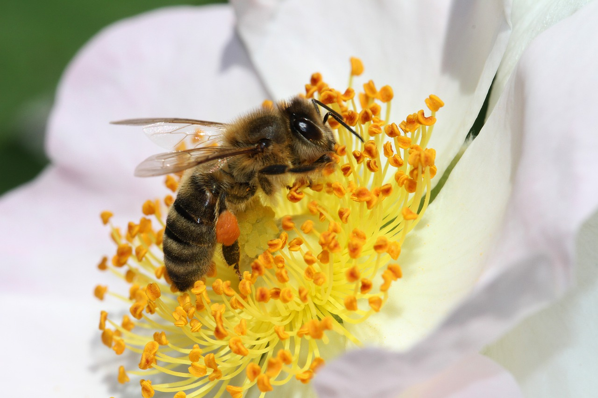

<!-- This is the markdown template for the final project of the Building AI course, 
created by Reaktor Innovations and University of Helsinki. 
Copy the template, paste it to your GitHub README and edit! -->

# BEe-intelligent
Let bees and planet Earth survive!

*Building AI course project*

## Summary

Bees are fundamental for life on our planet Earth but they are in danger due to chemical products used for agricolture.
Images from satellite and also public panoramic images from the internet can be processed by AI methods to build a map of safe areas for bees where beekeepers can bring their hives to let these little insects work safely.

<!-- 
## Background

Which problems does your idea solve? How common or frequent is this problem? What is your personal motivation? Why is this topic important or interesting?

This is how you make a list, if you need one:
* problem 1
* problem 2
* etc.
-->

## How is it used?

Images from countryside collected over the internet and from specific sources can be classified in respect of:
* chemical pollution level
* floreal species

This enables the whole system to build a map of areas in Europe with information about flower variety and chemical substances concentration.

The main users of the system are beekeepers that can find where to place their hives to let bees fly on flowers of a particular kind and avoid areas with higher pollution level.

## Data sources and AI methods
Every georeferenced image of a landscape or terrain of areas inside Europe can be used as an input for this project:
* satellite images
* public ones published on the internet
* images retrieved for the specific purpose of this project

Deep learning and neural networks are the main methods exploited to process images and classify them in respect of:
* chemical pollution level
* floreal species

This enables the whole system to build a map of areas in Europe where beekeepers can find specific flowers variety and avoid areas with higher pollution level.

<!--

## Challenges

What does your project _not_ solve? Which limitations and ethical considerations should be taken into account when deploying a solution like this?

-->

## What next?

Next step is ... the world! We can map even the whole world to help bees everywhere to find a clean environment for pollination!

## Acknowledgments

* Reaktor and University of Helsinki for the helpfull courses _"Elements of AI"_ and _"Building AI"_
* ... and my dear Diana for supporting me! 
